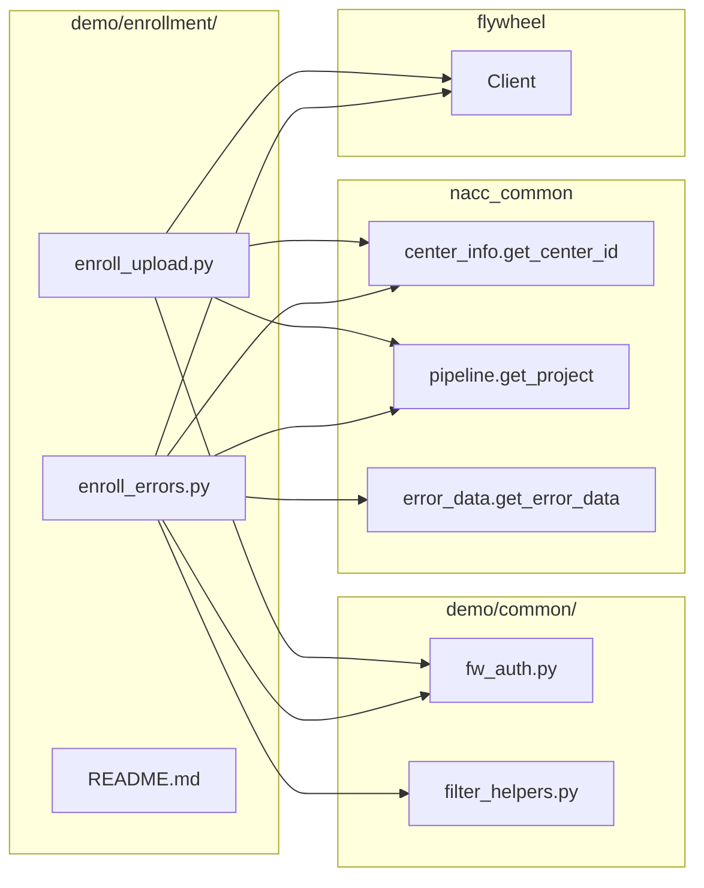

# Design Document

## Overview

This design adds a new `demo/enrollment/` directory containing two Python scripts and a README that demonstrate the enrollment data workflow on the NACC Data Platform:

- **`enroll_upload.py`** — Uploads an enrollment CSV file to the enrollment pipeline project.
- **`enroll_errors.py`** — Pulls enrollment-specific error data from the enrollment pipeline project, with optional module and PTID filtering.
- **`README.md`** — Documents usage, expected CSV format, CLI flags, and `uv run` commands.

Both scripts follow the established patterns of the existing demos (`demo/python-uploader/uploader.py` and `demo/pull_errors/pull_errors.py`) with one key difference: they hardcode `datatype="enrollment"` instead of exposing a `--datatype` CLI flag. This makes the enrollment workflow explicit and simpler for center data managers who don't need to think about datatype selection.

No new shared libraries or utilities are introduced. The scripts reuse `demo/common/fw_auth.py` for API key resolution, `demo/common/filter_helpers.py` for module/PTID filtering (error pull only), and `nacc_common` for center/pipeline/error lookups.

## Architecture

The enrollment demo follows the same architecture as all existing demos: standalone CLI scripts that compose shared helpers and the `nacc_common` SDK.

**Design decision — hardcoded datatype:** The existing `uploader.py` and `pull_errors.py` expose a `--datatype` flag that accepts `dicom`, `enrollment`, or `form`. The enrollment demo scripts hardcode `datatype="enrollment"` and omit the flag. This is intentional: the enrollment demo targets a specific workflow, and removing the flag reduces the chance of misconfiguration. Users who need a generic uploader can use the existing `python-uploader` demo.

**Design decision — no identifier pull script:** The existing `demo/pull_identifiers/pull_identifiers.py` already queries the enrollment pipeline with `datatype="enrollment"`. Adding a duplicate script to the enrollment demo would create maintenance burden with no benefit. The README will reference the existing demo for identifier pulls.

## Components and Interfaces

### `enroll_upload.py`

A CLI script that uploads an enrollment CSV to the enrollment pipeline project.

**Control flow** (mirrors `demo/python-uploader/uploader.py`):

1. Parse CLI arguments (`--adcid`, `--pipeline`, `--studyid`, `--api-key`, `filepath`).
2. Resolve API key via `fw_auth.get_api_key()`.
3. Create a `flywheel.Client`.
4. Look up the center group ID via `get_center_id()`.
5. Resolve the enrollment pipeline project via `get_project(datatype="enrollment")`.
6. Validate the file exists and is non-empty.
7. Upload the file via `project.upload_file()`.

**CLI interface:**

| Flag | Type | Required | Default | Description |
|------|------|----------|---------|-------------|
| `-a`/`--adcid` | int (0–99) | Yes | — | Center ADCID |
| `-p`/`--pipeline` | choice | No | `sandbox` | Pipeline type (`ingest` or `sandbox`) |
| `-s`/`--studyid` | str | No | `adrc` | Study identifier |
| `-k`/`--api-key` | str | No | — | Flywheel API key |
| `filepath` | positional | Yes | — | Path to enrollment CSV |

**Differences from `uploader.py`:**
- No `--datatype` flag; `datatype="enrollment"` is hardcoded in the `get_project()` call.
- Everything else is identical.

### `enroll_errors.py`

A CLI script that pulls enrollment error data from the enrollment pipeline project.

**Control flow** (mirrors `demo/pull_errors/pull_errors.py`):

1. Parse CLI arguments (`--adcid`, `--pipeline`, `--studyid`, `--api-key`, `--module`, `--ptid`, `--output`).
2. Resolve API key via `fw_auth.get_api_key()`.
3. Create a `flywheel.Client`.
4. Look up the center group ID via `get_center_id()`.
5. Resolve the enrollment pipeline project via `get_project(datatype="enrollment")`.
6. Collect module/PTID filter sets via `filter_helpers`.
7. Log active filters via `filter_helpers.log_active_filters()`.
8. Fetch error data via `get_error_data()`, passing module filter when present.
9. Post-filter by PTID via `filter_helpers.filter_by_ptids()`.
10. Write results to CSV using `DictWriter` with `ERROR_HEADER_NAMES`.

**CLI interface:**

| Flag | Type | Required | Default | Description |
|------|------|----------|---------|-------------|
| `-a`/`--adcid` | int (0–99) | Yes | — | Center ADCID |
| `-p`/`--pipeline` | choice | No | `sandbox` | Pipeline type (`ingest` or `sandbox`) |
| `-s`/`--studyid` | str | No | `adrc` | Study identifier |
| `-k`/`--api-key` | str | No | — | Flywheel API key |
| `-m`/`--module` | str (repeatable) | No | — | Module name filter |
| `-t`/`--ptid` | str (repeatable) | No | — | Participant ID filter |
| `-o`/`--output` | str | No | auto-generated | Output CSV path |

**Default output filename:** `enrollment-errors[-<modules>][-ptid-<ptids>]-<project-label>-<date>.csv`, generated by `filter_helpers.build_output_filename()` with prefix `"enrollment-errors"`.

**Differences from `pull_errors.py`:**
- No `--datatype` flag; `datatype="enrollment"` is hardcoded in the `get_project()` call.
- Default output filename prefix is `enrollment-errors` instead of `errors`.
- Everything else is identical (same filtering, same CSV output).

### `README.md`

Documents the enrollment demo with these sections:
- Purpose and overview
- Prerequisites (link to top-level README for environment setup)
- Upload usage with `uv run` examples
- Error pull usage with `uv run` examples, including filter flag examples
- Expected enrollment CSV format (columns: `module`, `adcid`, `ptid`, plus enrollment-specific fields)
- Note about running all commands from the repository root
- Reference to `demo/pull_identifiers/` for enrollment identifier queries

## Data Models

No new data models are introduced. The scripts work with existing structures:

- **Enrollment CSV input** — Standard CSV with columns including `module`, `adcid`, `ptid`, and enrollment-specific fields (e.g., `ENRLTYPE`, `PREVENRL`, `NACCIDKWN`). The exact schema is defined by the NACC Data Platform and validated server-side during pipeline processing.
- **Error data output** — List of dictionaries with keys matching `nacc_common.error_data.ERROR_HEADER_NAMES`. Written to CSV using `csv.DictWriter`.
- **CLI arguments** — Parsed via `argparse` into a `Namespace` object, consistent with all other demo scripts.

## Error Handling

Error handling follows the patterns established in `uploader.py` and `pull_errors.py`:

| Condition | Script | Behavior |
|-----------|--------|----------|
| Flywheel client creation fails | Both | Log error, `sys.exit(1)` |
| `get_center_id` raises `CenterError` | Both | Log error message, `sys.exit(1)` |
| No pipeline project found | Both | Log error, `sys.exit(1)` |
| File does not exist | Upload | Log error, `sys.exit(1)` |
| File is empty (0 bytes) | Upload | Log error, `sys.exit(1)` |
| No error records returned | Error pull | Log info message, return without writing file |
| No records after PTID filtering | Error pull | Log info message, return without writing file |

All error paths use `logging` at the appropriate level (`error` for fatal, `info` for empty-result conditions) before exiting or returning.

## Testing Strategy

### Why Property-Based Testing Does Not Apply

The two new scripts (`enroll_upload.py`, `enroll_errors.py`) are **thin CLI orchestration scripts** that wire together existing, already-tested components:

- `fw_auth.get_api_key()` — shared helper, tested elsewhere.
- `filter_helpers.*` — shared helper, already has property-based tests in `tests/test_filter_helpers.py` and unit tests in `tests/test_filter_helpers_unit.py`.
- `nacc_common.*` functions — external library, tested by its own test suite.
- `flywheel.Client` — external SDK.

The scripts introduce **no new pure functions, data transformations, parsers, or business logic**. Every code path is either a direct SDK call or a conditional exit. There are no universal properties of the form "for all inputs X, property P(X) holds" that would benefit from property-based testing. Running 100+ iterations of randomized inputs against these scripts would test Flywheel SDK behavior and nacc_common internals, not our code.

### Recommended Testing Approach

**Smoke tests (manual):**
- Verify `enroll_upload.py --help` prints the expected usage and flags.
- Verify `enroll_errors.py --help` prints the expected usage and flags.
- Confirm a successful upload against a sandbox project.
- Confirm a successful error pull against a sandbox project with known errors.

**Linting and type checking (automated, already in CI):**
- `uv run ruff check demo/enrollment/` — Catches style and import issues.
- `uv run mypy demo/enrollment/ --ignore-missing-imports` — Catches type errors.

These scripts are effectively configuration of existing components. The testing emphasis should be on linting, type checking, and manual smoke tests against the live platform, rather than automated unit or property tests.
