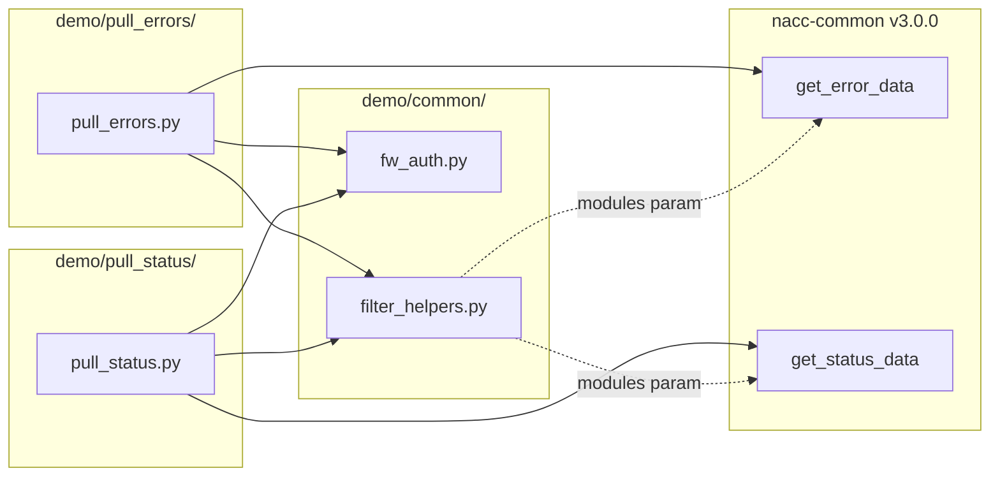

# Design Document: filter-errors-status

## Overview

This feature adds `--module` (`-m`) and `--ptid` (`-t`) command-line flags to the `pull_errors.py` and `pull_status.py` demo scripts. These flags let center data managers filter error and QC-status results by module name(s) and/or participant ID(s) without downloading the entire project's data and filtering manually.

The design leverages the existing `modules` parameter already supported by `nacc_common.error_data.get_error_data()` and `get_status_data()` for module filtering. PTID filtering is implemented as post-filtering on the returned dicts because `nacc-common` v3.0.0 does not expose the `ptid_set` parameter through its public API (though `ProjectReportVisitor` supports it internally — see `docs/nacc-common-v4-prompt.md` for the upstream request).

Both scripts share identical filtering logic, so the core parsing and filtering functions are extracted into a shared helper module at `demo/common/filter_helpers.py`, following the existing pattern of `demo/common/fw_auth.py`.

### Design Decisions

1. **Shared helper module over duplication**: Both scripts need identical argument parsing, normalization, PTID filtering, filename generation, and logging logic. Extracting this into `demo/common/filter_helpers.py` avoids copy-paste duplication and keeps the scripts focused on their specific data-pull logic.

2. **Post-filtering for PTID**: Although `ProjectReportVisitor` accepts `ptid_set`, the public `get_error_data`/`get_status_data` functions don't expose it. Post-filtering on the returned dicts is a clean stopgap that doesn't require forking or monkey-patching `nacc-common`. When v4 adds the `ptids` parameter, the post-filter can be replaced with a pass-through parameter — a one-line change per script.

3. **Comma-separated + repeatable flags**: Using `action="append"` with comma-splitting supports both `--module UDS,LBD` and `--module UDS --module LBD`. This matches common CLI conventions and is more ergonomic than requiring one style.

4. **Case-insensitive modules, case-sensitive PTIDs**: Module names are normalized to uppercase to match `nacc-common` conventions. PTIDs are kept as-is because they are exact identifiers from the platform.

## Architecture

The feature modifies two existing scripts and adds one new shared module. No new external dependencies are introduced.



### Data Flow

1. User invokes script with optional `--module` and `--ptid` flags
2. `filter_helpers.parse_filter_args()` adds the argparse arguments
3. `filter_helpers.collect_modules()` normalizes module names → `set[str] | None`
4. `filter_helpers.collect_ptids()` collects PTIDs → `set[str] | None`
5. `filter_helpers.log_active_filters()` logs active filters at INFO level
6. Script calls `get_error_data(project, modules=module_set)` or `get_status_data(project, modules=module_set)` — module filtering happens upstream in `nacc-common`
7. `filter_helpers.filter_by_ptids()` post-filters the returned list of dicts by the `ptid` key
8. `filter_helpers.build_output_filename()` generates a filename reflecting active filters
9. Script writes CSV output as before

## Components and Interfaces

### New Module: `demo/common/filter_helpers.py`

Pure functions for filter argument handling, with no Flywheel or nacc-common dependencies.

```python
"""Shared helpers for --module and --ptid CLI filtering."""

from __future__ import annotations

import argparse
import logging
from datetime import date
from typing import Any

log = logging.getLogger(__name__)


def add_filter_args(parser: argparse.ArgumentParser) -> None:
    """Add --module/-m and --ptid/-t arguments to an argparse parser.

    Both flags accept comma-separated values and can be repeated.
    """
    parser.add_argument(
        "-m",
        "--module",
        action="append",
        default=None,
        help="module name(s) to filter by (comma-separated, repeatable)",
    )
    parser.add_argument(
        "-t",
        "--ptid",
        action="append",
        default=None,
        help="participant ID(s) to filter by (comma-separated, repeatable)",
    )


def collect_modules(raw: list[str] | None) -> set[str] | None:
    """Parse and normalize module names to uppercase.

    Returns None when no modules were requested (meaning 'all modules').
    """
    if not raw:
        return None
    modules: set[str] = set()
    for entry in raw:
        for name in entry.split(","):
            stripped = name.strip()
            if stripped:
                modules.add(stripped.upper())
    return modules or None


def collect_ptids(raw: list[str] | None) -> set[str] | None:
    """Parse PTID values (case-sensitive).

    Returns None when no PTIDs were requested (meaning 'all PTIDs').
    """
    if not raw:
        return None
    ptids: set[str] = set()
    for entry in raw:
        for ptid in entry.split(","):
            stripped = ptid.strip()
            if stripped:
                ptids.add(stripped)
    return ptids or None


def log_active_filters(
    modules: set[str] | None,
    ptids: set[str] | None,
    logger: logging.Logger,
) -> None:
    """Log active filter values at INFO level."""
    if modules:
        logger.info("Filtering by modules: %s", ", ".join(sorted(modules)))
    if ptids:
        logger.info("Filtering by PTIDs: %s", ", ".join(sorted(ptids)))


def filter_by_ptids(
    records: list[dict[str, Any]],
    ptids: set[str] | None,
) -> list[dict[str, Any]]:
    """Post-filter records by PTID.

    Returns all records when ptids is None.
    """
    if ptids is None:
        return records
    return [r for r in records if r.get("ptid") in ptids]


def build_output_filename(
    prefix: str,
    project_label: str,
    modules: set[str] | None,
    ptids: set[str] | None,
) -> str:
    """Build a default output filename reflecting active filters.

    Pattern: <prefix>[-<modules>][-ptid-<ptids>]-<project_label>-<date>.csv
    Module and PTID segments are sorted and hyphen-joined.
    """
    parts: list[str] = [prefix]
    if modules:
        parts.append("-".join(sorted(modules)))
    if ptids:
        parts.append("ptid-" + "-".join(sorted(ptids)))
    parts.append(project_label)
    parts.append(str(date.today()))
    return "-".join(parts) + ".csv"
```

### Modified: `demo/pull_errors/pull_errors.py`

Changes to `main()`:

1. Import `filter_helpers` from `demo/common/`
2. Call `add_filter_args(parser)` after existing argument definitions
3. After getting the project, call `collect_modules()`, `collect_ptids()`, and `log_active_filters()`
4. Pass `modules=module_set` to `get_error_data()` (only when not None)
5. Call `filter_by_ptids()` on the result
6. Use `build_output_filename("errors", ...)` for the default filename

### Modified: `demo/pull_status/pull_status.py`

Identical changes as `pull_errors.py`, but calling `get_status_data()` and using `"qc-status"` as the filename prefix.

### Modified: README files

Both `demo/pull_errors/README.md` and `demo/pull_status/README.md` will be updated with usage examples for `--module`, `--ptid`, and combined usage.

## Data Models

### Filter State

No new persistent data models are introduced. The filter state is transient within a single script invocation:

| Value | Type | Source | Description |
|---|---|---|---|
| `module_set` | `set[str] \| None` | `collect_modules(args.module)` | Uppercase module names, or `None` for all |
| `ptid_set` | `set[str] \| None` | `collect_ptids(args.ptid)` | Participant IDs, or `None` for all |

### Record Dicts (from nacc-common)

The scripts operate on `list[dict[str, Any]]` returned by `get_error_data()` and `get_status_data()`. The relevant keys for filtering:

**Error records** (from `ErrorReportModel`):
- `ptid` — participant ID (from `FileError.ptid`, may be `None`)
- `module` — module name (from `ErrorReportModel.module`)
- Plus: `adcid`, `stage`, `error_type`, `error_code`, `message`, `location` fields, etc.

**Status records** (from `StatusReportModel`):
- `ptid` — participant ID
- `module` — module name
- Plus: `adcid`, `visitdate`, `stage`, `status`

PTID post-filtering matches on the `ptid` key in both record types.


## Correctness Properties

*A property is a characteristic or behavior that should hold true across all valid executions of a system — essentially, a formal statement about what the system should do. Properties serve as the bridge between human-readable specifications and machine-verifiable correctness guarantees.*

### Property 1: Module collection preserves all non-empty segments as uppercase

*For any* list of raw strings (simulating repeated `--module` flags), where each string contains comma-separated segments, `collect_modules` SHALL return a set containing exactly the uppercase version of every non-empty, whitespace-stripped segment — no segments are lost and no spurious values are added.

**Validates: Requirements 1.1, 1.2, 1.3, 1.4, 2.1, 2.2**

### Property 2: PTID collection preserves all non-empty segments verbatim

*For any* list of raw strings (simulating repeated `--ptid` flags), where each string contains comma-separated segments, `collect_ptids` SHALL return a set containing exactly every non-empty, whitespace-stripped segment with original casing preserved — no segments are lost, no spurious values are added, and no case transformation occurs.

**Validates: Requirements 4.1, 4.2, 4.3, 4.4**

### Property 3: PTID post-filter retains exactly the matching records

*For any* list of record dicts (each with a `ptid` key) and *any* optional set of PTID strings:

- When the PTID set is not None, `filter_by_ptids` SHALL return exactly those records whose `ptid` value is in the set, in their original order, with no records added or removed incorrectly.
- When the PTID set is None, `filter_by_ptids` SHALL return all records unchanged.

**Validates: Requirements 5.1, 5.2, 5.3, 5.4**

### Property 4: Output filename includes sorted filter segments

*For any* prefix string, project label, optional module set, and optional PTID set, `build_output_filename` SHALL produce a filename where:

- Every module in the set appears in the filename as a sorted, hyphen-joined segment.
- Every PTID in the set appears in the filename as a sorted, hyphen-joined segment prefixed with `ptid-`.
- When both sets are None, the filename matches `<prefix>-<project_label>-<date>.csv` with no filter segments.
- The filename always ends with `.csv`.

**Validates: Requirements 7.1, 7.2, 7.3, 7.4, 7.5, 7.6**

## Error Handling

| Scenario | Behavior | Rationale |
|---|---|---|
| `--module` with empty string (e.g., `--module ""`) | `collect_modules` returns `None` (empty segments are stripped) | Treat as "no filter" rather than erroring on accidental empty input |
| `--module` with only commas (e.g., `--module ",,"`) | `collect_modules` returns `None` | Same — all segments are empty after splitting |
| `--ptid` with empty string | `collect_ptids` returns `None` | Consistent with module handling |
| PTID post-filter finds zero matching records | Empty list returned, script writes a CSV with headers only | Consistent with existing behavior when `get_error_data` returns an empty list |
| Record dict missing `ptid` key | `dict.get("ptid")` returns `None`, which won't match any PTID in the filter set — record is excluded | Safe default; records without a PTID are excluded when PTID filtering is active |
| `get_error_data` / `get_status_data` raises `ReportError` | Existing error handling in scripts already catches this and exits | No change needed |
| No filters provided | All functions return `None` / pass-through; behavior is identical to current scripts | Backward compatibility (Requirement 8) |

No new exceptions are introduced. The helper functions are pure and cannot fail with unexpected exceptions given valid Python types.

## Testing Strategy

### Property-Based Tests

**Library**: [Hypothesis](https://hypothesis.readthedocs.io/) — the standard PBT library for Python.

**Configuration**: Minimum 100 examples per property (Hypothesis default is 100; we'll use `@settings(max_examples=100)` explicitly).

**Test file**: `tests/test_filter_helpers.py`

Each property test maps to a design property:

| Test | Design Property | Tag |
|---|---|---|
| `test_collect_modules_preserves_all_segments` | Property 1 | Feature: filter-errors-status, Property 1: Module collection preserves all non-empty segments as uppercase |
| `test_collect_ptids_preserves_all_segments` | Property 2 | Feature: filter-errors-status, Property 2: PTID collection preserves all non-empty segments verbatim |
| `test_filter_by_ptids_retains_matching_records` | Property 3 | Feature: filter-errors-status, Property 3: PTID post-filter retains exactly the matching records |
| `test_build_output_filename_includes_filter_segments` | Property 4 | Feature: filter-errors-status, Property 4: Output filename includes sorted filter segments |

### Example-Based Unit Tests

**Test file**: `tests/test_filter_helpers_unit.py`

| Test | Validates |
|---|---|
| `test_short_alias_m_for_module` | Requirements 1.5, 1.6 |
| `test_short_alias_t_for_ptid` | Requirements 4.5, 4.6 |
| `test_log_active_filters_modules` | Requirement 6.1, 6.3 |
| `test_log_active_filters_ptids` | Requirement 6.2, 6.4 |
| `test_log_active_filters_none` | No log output when no filters active |
| `test_default_filename_no_filters_errors` | Requirement 7.5 |
| `test_default_filename_no_filters_status` | Requirement 7.6 |
| `test_output_flag_overrides_default` | Requirements 7.7, 7.8 |
| `test_collect_modules_empty_input` | Edge case: empty/whitespace-only input returns None |
| `test_collect_ptids_empty_input` | Edge case: empty/whitespace-only input returns None |
| `test_filter_by_ptids_missing_key` | Edge case: records without `ptid` key |

### Integration Tests

**Test file**: `tests/test_scripts_integration.py`

These tests mock `nacc-common` and Flywheel dependencies to verify end-to-end script wiring:

| Test | Validates |
|---|---|
| `test_pull_errors_passes_modules_to_get_error_data` | Requirement 3.1 |
| `test_pull_status_passes_modules_to_get_status_data` | Requirement 3.2 |
| `test_pull_errors_no_modules_default` | Requirement 3.3 |
| `test_pull_status_no_modules_default` | Requirement 3.4 |
| `test_pull_errors_backward_compatible` | Requirement 8.1 |
| `test_pull_status_backward_compatible` | Requirement 8.2 |

### Dev Dependencies

Add to `pyproject.toml` under `[dependency-groups] dev`:

```toml
[dependency-groups]
dev = [
    "hypothesis",
    "mypy",
    "pytest",
    "ruff",
]
```

### Running Tests

```bash
# All tests
uv run pytest tests/ -v

# Property tests only
uv run pytest tests/test_filter_helpers.py -v

# Unit tests only
uv run pytest tests/test_filter_helpers_unit.py -v
```

Add a `test` target to the `Makefile`:

```makefile
test:
	uv run pytest tests/ -v
```
